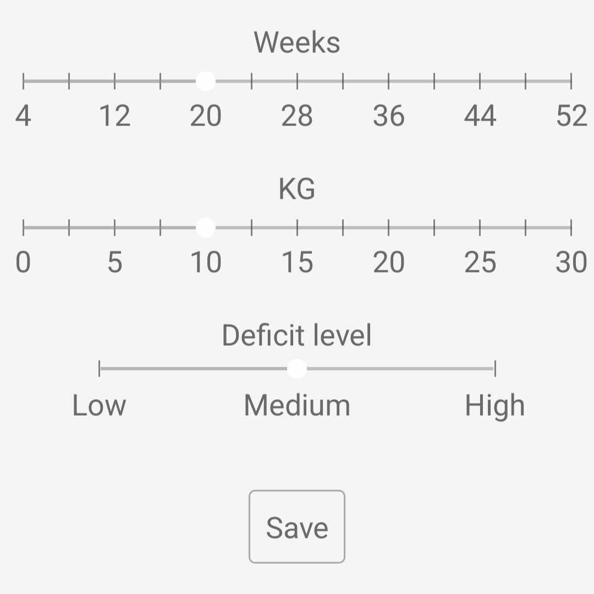
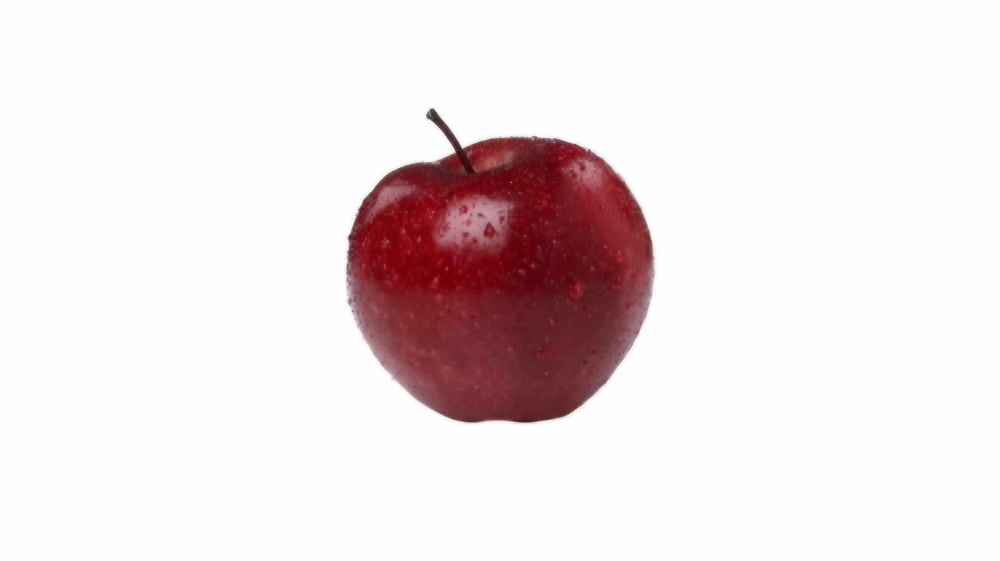

# PossibleWeightLossEstimator

## Overview
**PossibleWeightLossEstimator** is a mobile application developed using .NET MAUI for Android devices. This application provides users with a standardized method for estimating potential weight loss based on caloric deficit. 

## Features
* **User Management:** Add a single user by entering body weight, with an automatically incremented ID in the SQLite database.
* **Main Page:**
  * Displays three sliders for user interaction:
      * **Weeks Slider:** Adjusts the target weight loss.
      * **Kilograms slider:** Adjusts the target weight loss.
      * **Caloric deficit slider:** Adjusts the level of caloric deficit.
   * **Save Button:** Saves user input and calculations.
   * **Edit Button:** Allows users to modify body weight or delete theri account.
     

## Calculations 

The estimated weight loss and time span are calculated based on a maintenance calorie intake of **2500 kcal/day**. The caloric deficit levels are defined as follows:
* **Low Deficit:** 250 calories less per day
* **Medium Deficit:** 500 calories less per day
* **High Deficit:** 750 calories less per day

This application automatically adjust the kilograms slider based on selected number of weeks for the chosen caloric deficit, and it also adapts the number of weeks when the kilograms slider is adjusted.  

The weight loss calculation is based on 7700 kcal deficit per kilogram lost. 

## Customization

The application has been visually enhanced with custom images:
* **App Icon:** Sourced from [SVG REPO](https://svgrepo.com).

* **Splash Screen:** Designed using a free template from [FREEPIK](https://www.freepik.com/).

## Getting Started

To start using the PossibleWeightLossEstimator, simply download the application on your Andorid device. Upon first launch, you can enter your body weight to create a user profile, and the app will direct you to the Main Page for easy navigation. 
